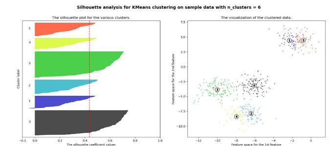

# Big-data-computing
Clustering of data points
In this project I cluster points based on their similarities which is their closest distance , different clusters are created in the data and the center of each clustar is selected among the data points.
I run the program by inserting the number of clusters needed and centers are selected from the data.
To evaluate similarities among points, I use the KMean clustering algorithm where distace computation among points are computed.  Points that are close to a particular center are put in a similar cluster.
Points that are closser to eachother are put in a particular cluster.
### Clustering example  

